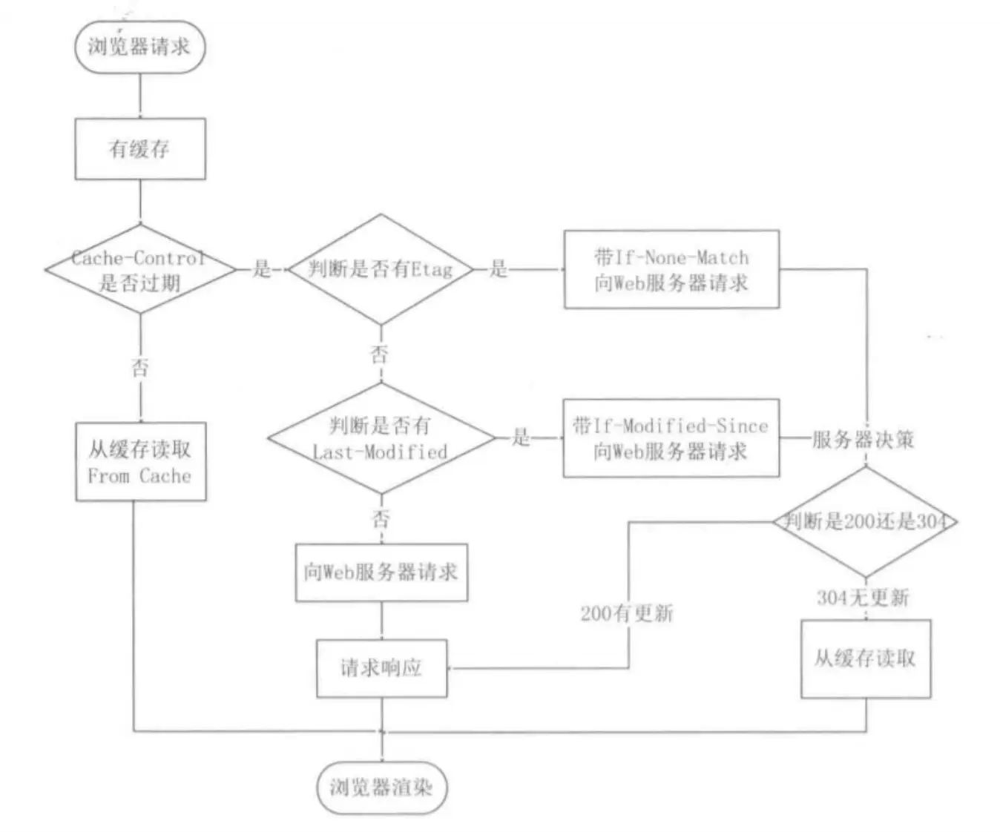

1、什么是http
HTTP 是一个在计算机世界里专门在「两点」之间「传输」文字、图片、音频、视频等「超文本」数据的「约定和规范」

2、状态码
- 2xx 成功
- 3xx 重定向
- 4xx 客户端错误
- 5xx 服务器错误

3、http缓存

4、http 不同版本特性
1. http1.1
   1. 长连接 一个tcp链接和有多个http请求和响应复用
   2. 管道网络通信，下一次请求不必等待响应可以继续发送下一次请求
   3. 队头阻塞 基于管道通信，前面的阻塞太久后面的请求没办法继续
   4. 头部未经压缩就发送，存在冗余。
2. http2
   1. 头部压缩，同时发送多个相似的请求时协议会消除重复的部分
   2. 报文采用二进制字节流
   3. 引入stream实现并发传输 
3. http3

5、https

